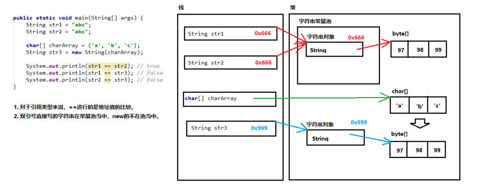

# 枚举和注解

枚举类

JDK1.5之前需要自定义枚举类

JDK 1.5 新增的 enum 关键字用于定义枚举类

若枚举只有一个成员, 则可以作为一种单例模式的实现方式

枚举类的属性

枚举类对象的属性不应允许被改动, 所以应该使用 private final 修饰

枚举类的使用 private final 修饰的属性应该在构造器中为其赋值

若枚举类显式的定义了带参数的构造器, 则在列出枚举值时也必须对应的传入参数

必须在枚举类的第一行声明枚举类对象。

枚举类和普通类的区别：

使用 enum 定义的枚举类默认继承了 java.lang.Enum 类

枚举类的构造器只能使用 private 访问控制符

枚举类的所有实例必须在枚举类中显式列出(, 分隔    ; 结尾). 列出的实例系统会自动添加 public static final 修饰

JDK 1.5 中可以在 switch 表达式中使用Enum定义的枚举类的对象作为表达式, case 子句可以直接使用枚举值的名字, 无需添加枚举类作为限定

枚举类的主要方法：

values()方法：返回枚举类型的对象数组。该方法可以很方便地遍历所有的枚举值。

valueOf(String str)：可以把一个字符串转为对应的枚举类对象。要求字符串必须是枚举类对象的“名字”。如不是，会有运行时异常。

image.png

实现接口的枚举类

和普通 Java 类一样，枚举类可以实现一个或多个接口。

若需要每个枚举值在调用实现的接口方法呈现出不同的行为方式, 则可以让每个枚举值分别来实现该方法。

# 注解 Annotation

JDK内置的基本注解类型（3个）

自定义注解类型

对注解进行注解（4个）

利用反射获取注解信息（在反射部分涉及）

## 概述

从 JDK 5.0 开始, Java 增加了对元数据(MetaData) 的支持, 也就是 Annotation(注解)

Annotation 其实就是代码里的特殊标记, 这些标记可以在编译, 类加载, 运行时被读取, 并执行相应的处理. 通过使用 Annotation, 程序员可以在不改变原有逻辑的情况下, 在源文件中嵌入一些补充信息.

Annotation 可以像修饰符一样被使用, 可用于修饰包,类, 构造器, 方法, 成员变量, 参数, 局部变量的声明, 这些信息被保存在 Annotation 的 “name=value” 对中.

Annotation 能被用来为程序元素(类, 方法, 成员变量等) 设置元数据

基本的 Annotation

使用 Annotation 时要在其前面增加 @ 符号, 并把该 Annotation 当成一个修饰符使用。用于修饰它支持的程序元素

三个基本的 Annotation:

@Override: 限定重写父类方法, 该注释只能用于方法

@Deprecated: 用于表示某个程序元素(类, 方法等)已过时

@SuppressWarnings: 抑制编译器警告

自定义 Annotation

定义新的 Annotation 类型使用 @interface 关键字

Annotation 的成员变量在 Annotation 定义中以无参数方法的形式来声明. 其方法名和返回值定义了该成员的名字和类型.

可以在定义 Annotation 的成员变量时为其指定初始值, 指定成员变量的初始值可使用 default 关键字

public @interface MyAnnotation{

String name() default “atguigu";

}

没有成员定义的 Annotation 称为标记; 包含成员变量的 Annotation 称为元数据 Annotation

提取 Annotation 信息

JDK 5.0 在 java.lang.reflect 包下新增了 AnnotatedElement 接口, 该接口代表程序中可以接受注解的程序元素

当一个 Annotation 类型被定义为运行时 Annotation 后, 该注释才是运行时可见, 当 class 文件被载入时保存在 class 文件中的 Annotation 才会被虚拟机读取

程序可以调用 AnnotationElement 对象的如下方法来访问 Annotation 信息

image.png

JDK 的元 Annotation

JDK 的元 Annotation 用于修饰其他 Annotation 定义

JDK5.0提供了专门在注解上的注解类型，分别是：

Retention

Target

Documented

Inherited

@Retention: 只能用于修饰一个 Annotation 定义, 用于指定该 Annotation 可以保留多长时间, @Rentention 包含一个 RetentionPolicy 类型的成员变量, 使用 @Rentention 时必须为该 value 成员变量指定值:

RetentionPolicy.SOURCE: 编译器直接丢弃这种策略的注释

RetentionPolicy.CLASS: 编译器将把注释记录在 class 文件中. 当运行 Java 程序时, JVM 不会保留注解。 这是默认值

RetentionPolicy.RUNTIME:编译器将把注释记录在 class 文件中. 当运行 Java 程序时, JVM 会保留注释. 程序可以通过反射获取该注释

@Target: 用于修饰 Annotation 定义, 用于指定被修饰的 Annotation 能用于修饰哪些程序元素. @Target 也包含一个名为 value 的成员变量.

@Documented: 用于指定被该元 Annotation 修饰的 Annotation 类将被 javadoc 工具提取成文档.

定义为Documented的注解必须设置Retention值为RUNTIME。

@Inherited: 被它修饰的 Annotation 将具有继承性.如果某个类使用了被 @Inherited 修饰的 Annotation, 则其子类将自动具有该注解

实际应用中，使用较少

public enum RetentionPolicy{
  SOURCE,
  CLASS,
  RUNTIME
}

@Retention(RetentionPolicy.SOURCE)
@interface MyAnnotation1{  }
@interface MyAnnotation2{  }

@Retention(RetentionPolicy.RUNTIME)
@interface MyAnnotation3{  }

1.编写一个Person类，使用Override注解它的toString方法

2.自定义一个名为“MyTiger”的注解类型，它只可以使用在方法上，带一个String类型的value属性，然后在第1题中的Person类上正确使用。