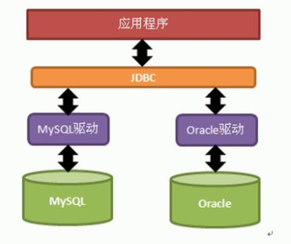

# 邮件

收发邮件的流程：发邮件是从客户端把邮件发送到邮件服务器，收邮件是把邮件服务器上的邮件下载到客户端。

我们在163网站上注册的账户，其实就是在邮件服务器中注册的。

## 邮件协议

SMTP(Simple Mail Transfer Protocol)，简单邮件传输协议，发邮件协议，服务器的端口号为25。

POP3(Post Office Protocol Version 3)，邮局协议第3版，收邮件协议，服务器的端口号为110。

IMAP(Internet Message Access Protocol)，因特网消息访问协议，收发邮件协议。

常见的邮件服务器有：

smtp.163.com 和 pop3.163.com

smtp.qq.com 和 pop3.qq.com

## 返回码

邮件服务返回代码含义：

500：格式错误，命令不可识别（此错误也包括命令行过长）

501：参数格式错误

502：命令不可实现

503：错误的命令序列

504：命令参数不可实现

211：系统状态或系统帮助响应

214：帮助信息

220：服务就绪

221：服务关闭传输信道

421：服务未就绪，关闭传输信道（当必须关闭时，此应答可以作为对任何命令的响应）

250：要求的邮件操作完成

251：用户非本地，将转发向

450：要求的邮件操作未完成，邮箱不可用（例如，邮箱忙）

550：要求的邮件操作未完成，邮箱不可用（例如，邮箱未找到，或不可访问）

451：放弃要求的操作；处理过程中出错

551：用户非本地，请尝试

452：系统存储不足，要求的操作未执行

552：过量的存储分配，要求的操作未执行

553：邮箱名不可用，要求的操作未执行（例如邮箱格式错误）

354：开始邮件输入，以. 结束

554：操作失败

535：用户验证失败

235：用户验证成功

334：等待用户输入验证信息

## telnet 发邮件

下面演示通过 QQ 邮箱用 telnet 来发送邮件。

首先打开 cmd，输入命令 telnet smtp.qq.com 25。

输入 helo qq.com，向服务器表明身份。

发送邮件前，需要先登陆，通过邮件服务器认证后才可以发送邮件。

输入 auth login，提示输入账户：

输入经过 base64 编码后的邮箱账号（用来发邮件的账号）字符串，提示输入密码：

输入开启 QQ 邮箱 IMAP/SMPT 时的授权码，提示成功了。

输入发件人邮箱：mail from:<53600056@qq.com>

输入收件人邮箱：rcpt to:<939328929@qq.com>

发送填写数据指令：data

开始输入数据，如下：

from:<53600056@qq.com>

to:<939328929@qq.com>

subject:我是标题

我是邮件正文

.

注意：标题和正文之间有一个空行，正文输入完之后输入一个 . 回车结束。

整体流程：

## java 发邮件

封装工具：

Session session = MailUtils.createSession("smtp.163.com", "用户名", "密码");Mail mail = new Mail("发信人", "收信人", "标题", "正文");AttachBean ab1 = new AttachBean(new File("f:/1.jpg"), "图片.jpg");AttachBean ab2 = new AttachBean(new File("f:/2.jpg"), "图片.jpg");mail.addAttach(ab1);mail.addAttach(ab2);MailUtils.send(session, mail);