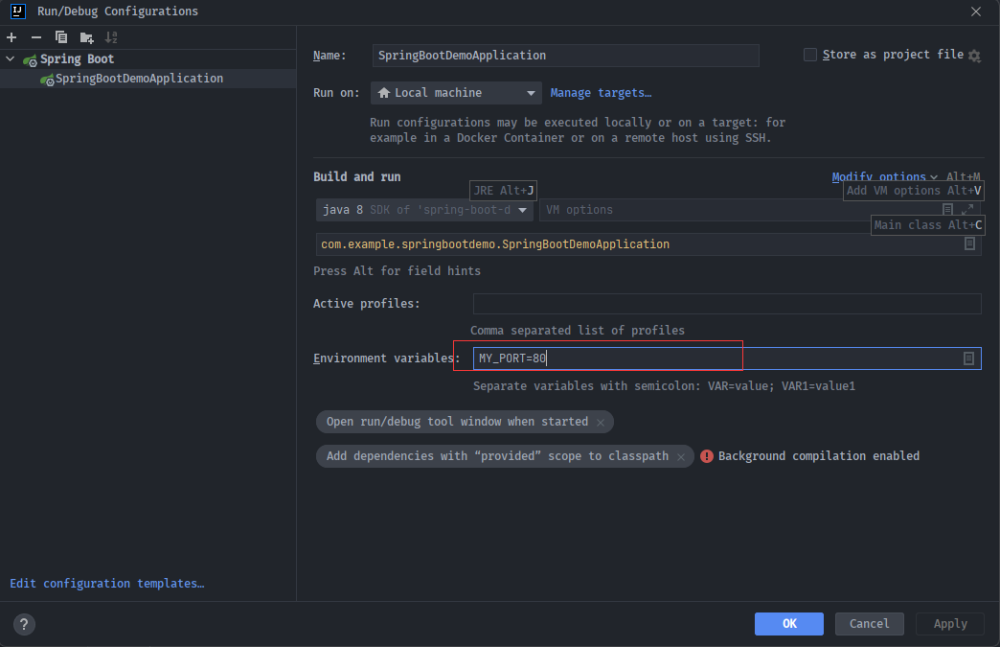

# 热部署

开发中经常需要修改类、页面等资源，修改后每次都得重新启动才生效，非常浪费时间。为了达到不重启就能生效的效果，在 pom.xml 中添加如下配置：

<dependency>  <groupId>org.springframework.boot</groupId>  <artifactId>spring-boot-devtools</artifactId></dependency>

此时热部署还没有生效，原因在于 IDEA 默认情况下不会自动编译，需要对 IDEA 进行配置。

勾选 Build project automatically 后，输入快捷键 shift+ctrl+alt+/，选择 Registry。

此时热部署才会生效。

