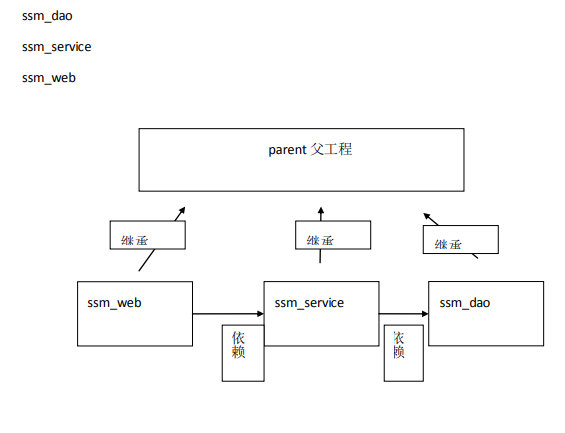
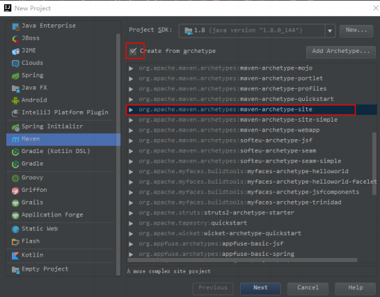
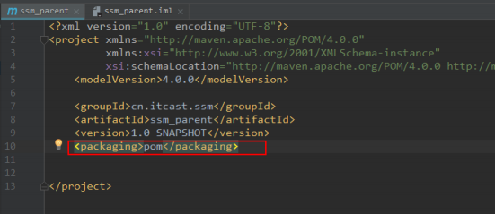
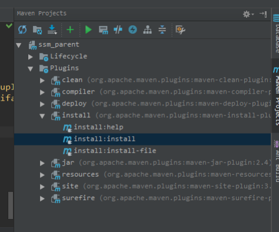
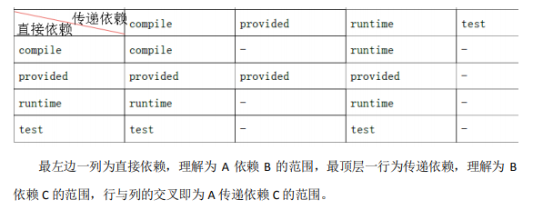
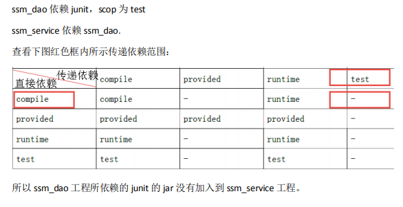

# Maven 高级特性

## 1. 依赖传递
引用 `spring-webmvc` 坐标，发现项目依赖中出现 `spring-beans.jar` 等 jar 包，说明 `spring-webmvc` 依赖于这些 jar 包。这种现象称为依赖传递。


当我们引入的不同的 jar 包依赖于一个相同 jar 包的不同版本时，就会出现依赖冲突。针对依赖冲突，Maven 会按照两个原则自动进行调解。


+ 声明者优先原则：以项目依赖的先后顺序为准。
+ 路径近者优先原则：当我们引入的不同的 jar 包依赖于一个相同 jar 包的不同版本时，可以手动把这个共同依赖的 jar 包进行坐标导入，此时整个工程会以手动导入的 jar 包为准。


上边的问题也可以通过排除依赖方法辅助依赖调解，举例说明：

```xml
<dependency>
  <groupId>org.springframework</groupId>
  <artifactId>spring-web</artifactId>
  <version>5.2.15.RELEASE</version>
  <exclusions>
    <exclusion>
      <groupId>org.springframework</groupId>
      <artifactId>spring-beans</artifactId>
    </exclusion>
  </exclusions>
</dependency>

<dependency>
  <groupId>org.springframework</groupId>
  <artifactId>spring-context</artifactId>
  <version>4.3.5.RELEASE</version>
</dependency>
```

面对众多的依赖，有一种方法不用考虑依赖路径、声明优化等因素可以采用直接锁定版本的方法确定依赖构件的版本，版本锁定后则不考虑依赖的声明顺序或依赖的路径，以锁定的版本的为准添加到工程中，此方法在企业开发中常用。

```xml
<properties>
	<spring.version>5.0.2.RELEASE</spring.version>
</properties>

<dependencies>
  <dependency>
    <groupId>org.springframework</groupId>
    <artifactId>spring-web</artifactId>
    <version>${spring.version}</version>
  </dependency>

  <dependency>
    <groupId>org.springframework</groupId>
    <artifactId>spring-context</artifactId>
    <version>${spring.version}</version>
  </dependency>
</dependencies>
```

## 分模块构建工程
继承：创建一个 parent 工程将所需的依赖都配置在 pom 中

聚合：聚合多个模块运行。


<!-- 这是一张图片，ocr 内容为：ssmdao ssmservice ssmweb parent父工程 继承 继承 继承 ssmdao ssmweb ssmservice 人 之透 -->


继承是为了消除重复，如果将 dao、service、web 分开创建独立的工程则每个工程的 pom.xml文件中的内容存在重复，比如：设置编译版本、锁定 spring 的版本的等，可以将这些重复的配置提取出来在父工程的 pom.xml 中定义。


项目开发通常是分组分模块开发，每个模块开发完成要运行整个工程需要将每个模块聚合在一起运行，比如：dao、service、web 三个工程最终会打一个独立的 war 运行。


创建父工程：

<!-- 这是一张图片，ocr 内容为：GwProject JavaEnterprisc PRojectSDk: TI(avaversion1.8.0_144) JBO55 J2HE AoDArCHETYPe. eateFronarchetype Clouds ore.opache.maven.archetypes:maven-archetype-nojo spring org.apache.maven.rchetypes:maven-archetype-portlct JavaFX org.opache.mavenrchetypesnofl org.apache.mven.rchtypes:venarchetype-qutckstart Android org.apache.maven.archetypes:maven-archetype-site FINTEIIPIOTFORMPIUEiN ore.apache.enchtpesaenchetype-sitese SpringInitiolizr ore.apache.maven.archetypes:mavenarchetype-ebaop ore.apache.mavcn.archetypes:softeuarchetype-jsf GRadIe(KotiinDSL) org.opache.mcnrchetypes:softeu-archetype-sca orgapache.maven.rchetypes:softeu-archetype-scam-simole Grad1e org.apache.ayfaces.bunatoocetypo Groovy org.apachefce Griffon ore.apacheyfacesuooe ore.apache.myfoces.bujatooi Grails org.opache.struts:struts2-rchetype-starter APplicotionFoREe oRe.apache.tapestryquickstart StaticHeb oRg.opacheMicket:icketrchetypequickstat Flash oRg.appfuse.archetypes:appfuse-basic-jsf org.apofuse.archetypes:appfuse-basic-soring Kotiin EmptyProjcct ABerecotplexsiteproject HeIp Next Previous CanceI -->


修改打包方式：

<!-- 这是一张图片，ocr 内容为：ssnparent.im snparent xmlversion"1.0"encoding-"UTF-8"?> <projectxmins-"http://maven.apache.org/PoM/4.0.0" xmIns:xsie"http://ww.31/cmiac xsi:schemalocation"httc <modeiversion>4.0.0/modeiversion> <groupId>cn.itcast.ss/roupd <artifactidssmparentartifactid <version>1.0-SNAPSHOT/version <packaging>pomK/packaging> 12 </project> 13 -->


在父工程的 pom.xml 中抽取一些重复的配置的，比如：锁定 jar 包的版本、设置编译版本等。


将父工程发布至仓库：

<!-- 这是一张图片，ocr 内容为：MavenProjecTs 十0m uataoa ssm_parent lifecycle Plugins clean(org.apache.naven.piugins:maven-cean-piugin; up] compiler(org.apache.aen.pugins:mencomper- ife deploy(org.apache.maven.plugins:maven-deploypiug pinstal(org.apache.maven.plugins:meninst- instaii:help install:instal1 instail:instaii-file mjar(org.apache.naven.plugins:maven-jarplugin:2. resources(org.apache.maven.piugins:maven-resources m msite(org.apacne.maven.plugins:maven-site-plugin:3. surefire(org.apache.maven.piugins:maven-surefire- -->


此操作是方便子工程继承。


注意各模块之间的依赖关系，需要填写坐标。


多模块有依赖关系时，依赖范围对传递依赖的影响，如下表：

<!-- 这是一张图片，ocr 内容为：传递依棘 test compile runtime provided 直接依赖 compile compile runtime provided provided provided provided runtime runtime runtime test test test 最左边一列为直接依赖,理解为A依赖B的范围,最顶层一行为传递依赖,理解为B 依赖的范围,行与列的交叉即为A传递依赖的范围. -->


<!-- 这是一张图片，ocr 内容为：ssm-dao依赖junit,scop为test ssm_service依赖ssmdao, 查看下图红色框内所示传递依赖范围: 传递依赖 compile provided runtime test 直接依赖 compile runtime compile provided provided provided provided runtime runtime runtime test test test 所以ssmdao工程所依赖的junit的jar没有加入到ssmservice工程 -->


遇到依赖没有传递过来的问题我们通常的解决方案是在本工程中直接添加依赖，所以 ssm_service 直接导入 junit 即可。


运行调试：

方法 1：在 ssm_web 工程的 pom.xml 中配置 tomcat 插件运行

运行 ssm_web 工程它会从本地仓库下载依赖的 jar 包，所以当 ssm_web 依赖的 jar 包内容修

改了必须及时发布到本地仓库，比如：ssm_web 依赖的 ssm_service 修改了，需要及时将北京市昌平区建材城西路金燕龙办公楼一层 电话：400-618-9090

ssm_service 发布到本地仓库。

方法 2：在父工程的 pom.xml 中配置 tomcat 插件运行，自动聚合并执行

推荐方法 2，如果子工程都在本地，采用方法 2则不需要子工程修改就立即发布到本地仓库，

父工程会自动聚合并使用最新代码执行。

注意：如果子工程和父工程中都配置了 tomcat 插件，运行的端口和路径以子工程为准。


