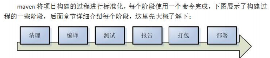
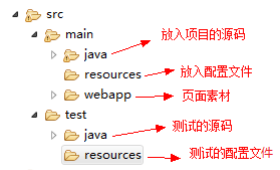
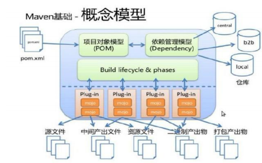
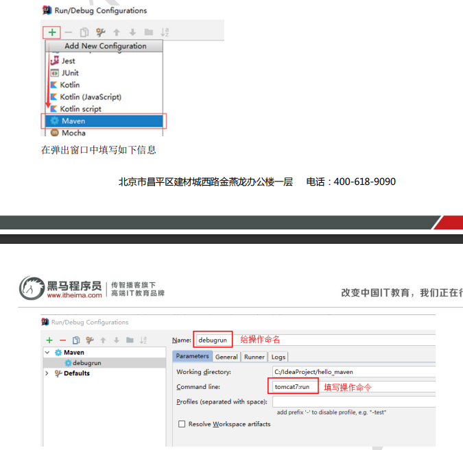

# Maven 入门指南

## 1. 简介

Maven 是一个项目管理工具，可以用来管理 jar 包、编译代码、自动运行单元测试、打包、生成报表，甚至还能部署项目，生成 Web 站点。


在不使用 Maven 管理项目时，项目所依赖的 jar 包都要添加到工程中，否则项目不能运行。使用 Maven 后，工程的体积会小很多，如果此时工程里没有 jar 包，项目怎么运行？


## 依赖管理
Maven 的一个核心特性就是依赖管理。当我们涉及到多模块的项目（包含成百个模块或者子项目），管理依赖就变成一项困难的任务。


Maven 工程中不直接将 jar 包导入到工程中，而是通过在 pom.xml 文件中添加所需 jar 包的坐标，这样就很好的避免了 jar 包直接引入进来，在需要用到 jar 包的时候，只要到 pom.xml 文件中查找到坐标，然后到一个专门用于存放 jar 包的仓库中找到 jar 包即可。


Maven 中也有索引的概念，通过建立索引，可以大大提高加载 jar 包的速度，基本跟放在本地工程文件中再读取出来的速度是一样的。


## 一键构建
项目一般都要经历编译、测试、运行、打包、安装 、部署等一系列过程，使用 Maven 一键构建可以轻松地通过一个命令完成以上工作。


Maven 规范化构建流程如下：



## Maven 仓库


Maven 仓库的分类：

+ 本地仓库：用来存储从远程仓库或中央仓库下载的插件和 jar 包，当项目需要使用一些插件或 jar 包时，优先从本地仓库查找。
+ 远程仓库：当本地仓库没有找到某个 jar 包或插件时，就会去远程仓库继续查找。远程仓库可以在互联网内也可以在局域网内。
+ 中央仓库：它是官方的仓库，服务于整个互联网，里面存放着全面的 jar 包。


本地仓库默认的位置为 `用户目录/.m2/repository/` 目录，Maven 支持更改本地仓库位置。当需要修改时，可以打开 `MAVEN_HOME/conf/settings.xml` 文件：

```xml
<localRepository>d:/maven_repo</localRepository>
```

你还可以在运行时指定本地仓库位置：

```shell
mvn clean install -Dmaven.repo.local=d:\yourpath
```

## 全局设置和用户设置
在 Maven 安装目录下的有 `MAVEN_HOME/conf/setting.xml` 文件，此 `setting.xml` 文件用于 Maven 的所有项目，它作为 Maven 的全局配置。


如需要个性配置则需要在用户配置中设置，针对用户配置需要对 `用户目录/.m2/repository/` 下的 `setting.xml` 进行修改。 


对于两个配置文件的优先级来说，Maven 会先用户配置为准，没有用户配置文件，就以全局配置为准。


## Maven 工程的目录结构



## Maven 工程的运行
进入命令行，输入 `tomcat:run` 命令。


## 常用命令


### compile
`mvn compile` 是 Maven 工程的编译命令，作用是将 `src/main/java` 下的文件编译为 class 文件输出到 target 目录下。


### test
`mvn test` 是 Maven 工程的测试命令，会执行 `src/test/java` 下的单元测试类。


### clean
`mvn clean` 是 Maven 工程的清理命令，执行后会删除 target 目录及内容。


### package
`mvn package` 是 Maven 工程的打包命令，对于 java 工程打成 jar 包，对于 web 工程打成 war包。


### install
`mvn install` 是 Maven 工程的安装命令，执行后会把打的包发布到本地仓库。


当后面的命令执行时，前面的操作过程也都会自动执行。


## 生命周期
Maven 对项目构建过程分为三套相互独立的生命周期。


+ `Clean Lifecycle`：在进行真正的构建之前进行一些清理工作。
+ `Default Lifecycle`：构建的核心部分，编译，测试，打包，部署等等。
+ `Site Lifecycle`：生成项目报告，站点，发布站点。


## 概念模型
Maven 包含了一个项目对象模型 (Project Object Model)，一组标准集合，一个项目生命周期(Project Lifecycle)，一个依赖管理系统(Dependency Management System)，和用来运行定义在生命周期阶段(phase)中插件(plugin)目标(goal)的逻辑。




### 项目对象模型 (Project Object Model)
每个 Maven 工程都有一个 `pom.xml` 文件，通过 `pom.xml` 文件定义项目的坐标、项目依赖、项目信息、插件目标等。


### 依赖管理系统(Dependency Management System)
通过 Maven 的依赖管理对项目所依赖的 jar 包进行统一管理。

```xml
<!-- 依赖关系 -->
<dependencies>
  <!-- 此项目运行使用 junit，所以此项目依赖 junit -->
  <dependency>
    <!-- junit 的项目名称 -->
    <groupId>junit</groupId>
    <!-- junit 的模块名称 -->
    <artifactId>junit</artifactId>
    <!-- junit 版本 -->
    <version>4.9</version>
    <!-- 依赖范围：单元测试时使用 junit -->
    <scope>test</scope>
  </dependency>
</dependencies>
```


## 依赖范围
+ compile：编译范围，指 A 在编译时依赖 B，此范围为默认依赖范围。编译范围的依赖会用在编译、测试、运行，由于运行时需要所以编译范围的依赖会被打包。
+ provided：只有在当 JDK 或者一个容器已提供该依赖之后才使用， provided 依赖在编译和测试时需要，在运行时不需要，比如：servlet api 被 tomcat 容器提供。
+ runtime：runtime 依赖在运行和测试系统的时候需要，但在编译的时候不需要。比如：jdbc 的驱动包。由于运行时需要所以 runtime 范围的依赖会被打包。
+ test：在编译和运行时都不需要，它们只有在测试编译和测试运行阶段可用，比如：junit。由于运行时不需要所以 test范围依赖不会被打包。
+ system：与 provided 类似，但是你必须显式的提供一个对于本地系统中 jar 文件的路径，需要指定 systemPath 磁盘路径，system依赖不推荐使用。


设置 jdk 编译版本

```xml
<build></build>
```


如何添加 Tomcat 插件？不生效


断点调试



dependencyManagement是表示依赖jar包的声明，即你在项目中的dependencyManagement下声明了依赖，maven不会加载该依赖，dependencyManagement声明可以被继承。

dependencyManagement的一个使用案例是当有父子项目的时候，父项目中可以利用dependencyManagement声明子项目中需要用到的依赖jar包，之后，当某个或者某几个子项目需要加载该插件的时候，就可以在子项目中dependencies节点只配置 groupId 和 artifactId就可以完成插件的引用。


dependencyManagement主要是为了统一管理插件，确保所有子项目使用的插件版本保持一致，类似的还是plugins和pluginManagement。

